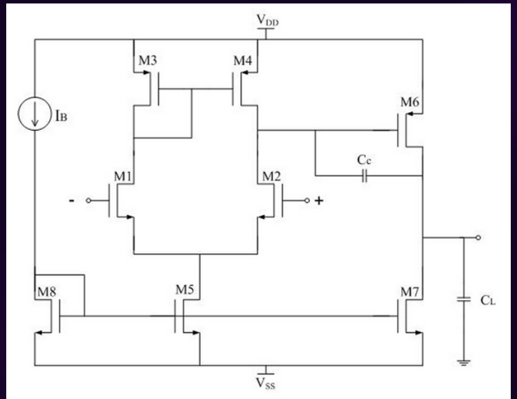

<h3>Table of Contents</h3>
<ul>
    <li><a href="#introduction">Introduction</a></li>
    <li><a href="#overview">Overview</a></li>
    <li><a href="#implementation">Implementation</a></li>
    <li><a href="#installation-and-setup">Installation and Setup</a></li>
    <li><a href="#usage">Usage</a></li>
    <li><a href="#results-and-performance">Results and Performance</a></li>
    <li><a href="#future-work">Future Work</a></li>
    <li><a href="#team">Team</a></li>
</ul>

<h3 id="introduction">Introduction</h3>

    

        The project aims to design a <b>two-stage Miller-compensated operational amplifier</b> (op-amp) that is optimized for driving a<b> capacitive load</b>. The circuit diagram for this design is illustrated below.
    

    

<h3 id="overview">Overview</h3>

    <h4>Two-Stage Miller-Compensated Op-Amp with a Capacitive Load</h4>
    

        A two-stage Miller-compensated op-amp consists of two main amplification stages with compensation applied to ensure stability, especially when driving capacitive loads. The Miller compensation technique involves using a compensation capacitor to create a dominant pole, thereby enhancing the phase margin.
    

    

        <b>First Stage: Differential Amplifier</b>: provides the initial amplification and high input impedance. It typically consists of a pair of transistors configured to amplify the difference between the input signals.
    

    

        <b>Second Stage: Gain Stage</b>: The second stage is a gain stage that further amplifies the signal. This stage involves a common-source amplifier, which provides high gain and drives the output stage.
    

    

        <b>Miller Compensation</b>: Miller compensation is implemented by connecting a compensation capacitor between the output of the first stage and the input of the second stage. This capacitor introduces a dominant pole, which reduces the gain at higher frequencies and improves the phase margin, thus enhancing the stability of the amplifier.
    

    

        <b>Capacitive Load</b>: In applications where the op-amp needs to drive a capacitive load, the Miller-compensated design is particularly beneficial. Capacitive loads can cause phase shift and potentially lead to instability. The compensation capacitor helps mitigate these effects by controlling the frequency response of the amplifier.
    

## Circuit Analysis and Design Specifications

|    Parameter     |  Value   |
| :--------------: | :------: |
|  VDD  |   1.8V   |
| Ibias |   40μA   |
|  Gain-Bandwidth  |  15 MHz  |
|  Av   | 3000 V/V |
|   Phase margin   |   60°    |
|  CL   |  10 pF   |
| Power Dissipated |  200 μW  |
|    Slew Rate     | 10 V/μs  |

<h3 id="implementation">Implementation</h3>
<h4>DC Balance Conditions for Two Stage Op-Amp</h4>

$$Considering \ \ S_i = \frac{W_i}{L_i} \ \ for \ \ i^{th} \ \ transistor$$

For optimal performance, all transistors need to be kept in <b>saturation</b>. <code>M4</code> is the only one that cannot be forced into saturation, regardless of any internal or external voltages applied. Therefore, conditions must be established to force it into saturation.

To achieve this, assume that VSG4 = VSG6. Consequently, the gate and drain of <code>M4</code> will be at the same potential, leading <code>M4</code> into saturation. We then delve into the following equations.

$$V_{SG_4} = V_{SG_6} => I_6 = \frac{S_6}{S_4}*I_4$$

$$I_7 = \frac{S_7}{S_5}*I_5 = \frac{S_7}{S_5}*2I_4$$

$$For \ \ Balance \ \ Condition \ \ \frac{S_6}{S_4} = \frac{2*S_7}{S_5}$$

$$V_{DG_4} = 0$$

If balance conditions are satisfied, <code>M4</code> is in saturation.

<h4>Design Procedure</h4>

    In reference to the design specifications mentioned above, the following calculations have been performed to design the circuit.

For a desired Phase Margin of 60o, it is necessary to choose a minimum value for CC as defined by the following relation:

$$C_c > 0.22*C_L$$

    Given that I have chosen CL as 10 pF, using the above relation, <b>CC &gt; 2.2 pF</b>.

    Choosing <b>CC = 3 pF</b>, using the Slew Rate specifications, I5 can be calculated as follows:

$$I_5 = SR*C_C = (10*10^6)*(3*10^{-12}) = 30 μA$$

Determining S3 using ICMR requirements, 

$$S_3 = S_4 = \frac{I_5}{K_3^{'}*[V_{DD} - V_{in}^{max} - |V_{T3}| + V_{T1}]^2} = 30$$

In order to compute, S1 and S2, I need to first determine value of gm1.

$$g_{m1} = GB*C_C = (2*pi*5*10^6)*(3*10^{-12}) = 94.25μS$$

$$S_1 = S_2 = \frac{g_{m1}^2}{2*K_1^{'}*I_1} = 3$$

Calculating  S5 using the following relation

$$S_5 = \frac{2*I_5}{K_5^{'}*V_{DS_5}^2} = 6$$

For a 600 phase margin, <b>gm6 >= 10*gm1</b>, leading to <b>g<sib>m6 = 942.5μS</b>

$$S_6 = \frac{g_{m6}}{g_{m4}} * S_4 = 190$$

$$I_6 = \frac{g_{m6}^2}{2*K_6^{'}*S_6} = 95μA$$

The above value exceeds the design specification, but gives better phase margins. 

$$S_7 = S_8 =  S_5*\frac{I_6}{I_5} = 19$$

For the final step, with the desired ratios for all the transistors determined, I proceed to calculate the gain and validate whether it meets our design specifications.

$$A_v = \frac{2*g_{m1}*g_{m6}}{I_5*(λ_2+λ_4)*I_6*(λ_6+λ_7)} = 3180\frac{V}{V}$$

<h3 id="installation-and-setup">Installation and Setup</h3>

    Clone the git repo using: <code>git clone https://github.com/asood-life/miller-compensated-op-amp.git</code>

<h3 id="usage">Usage</h3>

    Open the model <code>circuit.slx</code> and run the simulation to observe the results.

<h3 id="results-and-performance">Results and Performance</h3>

<h3 id="future-work">Future Work</h3>
<ul>
    <li>
        <strong>Optimize Transistor Sizing for Enhanced Performance</strong>
        
Further investigation into the transistor sizing is necessary to achieve an optimal balance between gain, bandwidth, and power consumption. By fine-tuning the sizes of the transistors in the differential pair and current mirrors, the overall performance of the op-amp can be improved. This includes optimizing the gain-bandwidth product and ensuring that the op-amp meets the required specifications under different operating conditions.

    </li>
    <li>
        <strong>Implement Advanced Compensation Techniques</strong>
        
Exploring advanced compensation methods, such as nested Miller compensation or adaptive compensation, can enhance the stability and performance of the op-amp. These techniques aim to improve phase margin and reduce the likelihood of oscillations or instability in the circuit.

    </li>
    <li>
        <strong>Conduct Post-Layout Simulations and Testing</strong>
        
After completing the layout design, it's crucial to perform post-layout simulations to validate the op-amp's performance under realistic conditions. This includes accounting for parasitic effects such as capacitances and inductances that arise during the physical layout.

    </li>
</ul>

<h3 id="team">Team</h3>

    <table>
        <tr align="center">
            <td>
                 
                <a href="https://github.com/asood-life">Akshat Sood</a>
            </td>
        </tr>
    </table>

    Thank you for visiting! If you find value in this project, please consider giving it a ⭐ star. Your support is greatly appreciated and assists others discover the project. If you have any requests for enhancements or find any bugs, please report them under <a href="https://github.com/asood-life/miller-compensated-op-amp/issues">Issues</a>. Your feedback is invaluable in making this project better for everyone.

