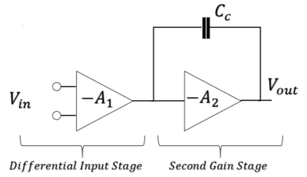
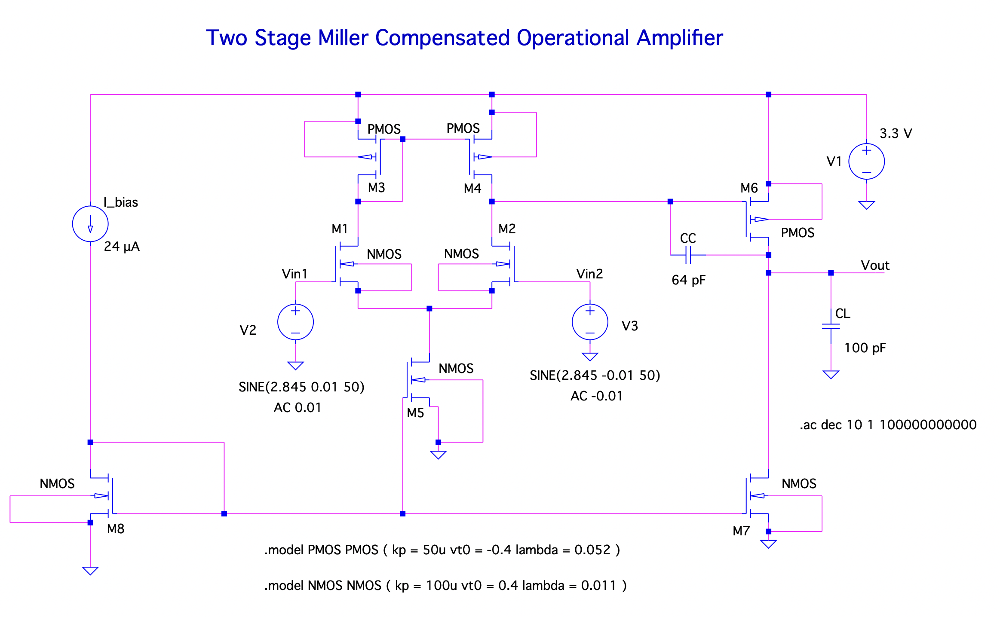
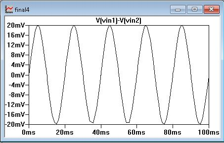
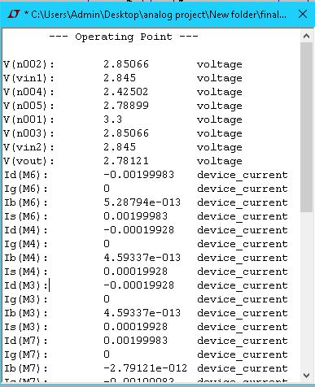
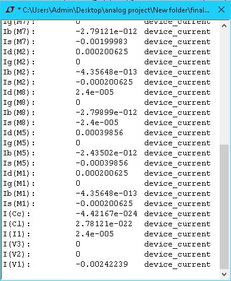
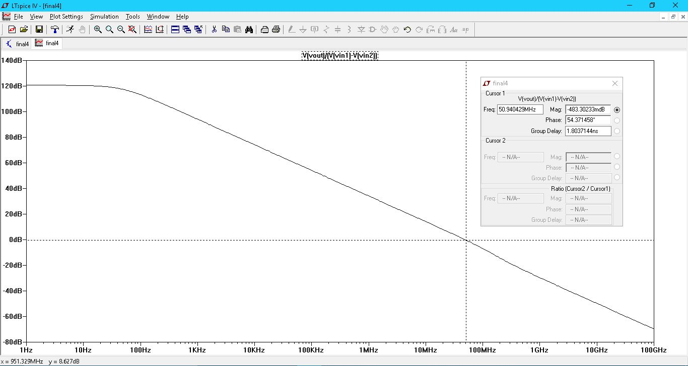

<h3>Table of Contents</h3>
<ul>
    <li><a href="#introduction">Introduction</a></li>
    <li><a href="#overview">Overview</a></li>
    <li><a href="#implementation">Implementation</a></li>
    <li><a href="#results">Results</a></li>
    <li><a href="#future-work">Future Work</a></li>
    <li><a href="#team">Team</a></li>
</ul>

<h3 id="introduction">Introduction</h3>

    

        The project aims to design a <b>two-stage Miller-compensated operational amplifier</b> (op-amp) that is optimized for driving a<b> capacitive load</b>. The circuit diagram for this design is illustrated below.
    

    

<h3 id="overview">Overview</h3>

    

        A two-stage Miller-compensated op-amp consists of two main amplification stages with compensation applied to ensure stability, especially when driving capacitive loads. The Miller compensation technique involves using a compensation capacitor to create a dominant pole, thereby enhancing the phase margin.
    

    

 

    

        <b>First Stage: Differential Amplifier</b>: provides the initial amplification and high input impedance. It typically consists of a pair of transistors configured to amplify the difference between the input signals to the circuit.
    

    

        <b>Second Stage: Gain Stage</b>: The second stage is a gain stage that further amplifies the signal. This stage involves a common-source amplifier, which provides high gain and drives the output stage.
    

    

        <b>Miller Compensation</b>: Miller compensation is implemented by connecting a compensation capacitor between the output of the first stage and the input of the second stage. This capacitor introduces a dominant pole, which reduces the gain at higher frequencies and improves the phase margin, thus making the amplifier stable.
    

    

        <b>Capacitive Load</b>: In applications where the op-amp requires to drive a capacitive load, the Miller-compensated design is particularly beneficial. Capacitive loads can cause phase shift and potentially lead to unstable circuit.
    

<h4>Circuit Analysis and Design Specifications</h4>

|    Parameter     |  Value   |
| :--------------: | :------: |
|  VDD  |  $$3.3 \ V$$   |
|  Gain-Bandwidth  |  $$50 \ MHz$$  |
| Ibias |  $$24 \ μA$$   |
| Open Loop Gain | $$120 \ dB$$ |
|  CL   |  $$100 \ pF$$   |
| Power Dissipated |  $$8 \ mW$$  |
|    Slew Rate     | $$1 \ \frac{V}{μs}$$  |

<h3 id="implementation">Implementation</h3>
<h4>DC Balance Conditions for Two Stage Op-Amp</h4>

$$Considering \ \ S_i = \frac{W_i}{L_i} \ \ for \ \ i^{th} \ \ transistor$$

For optimal performance, all transistors need to be kept in <b>saturation</b>. <code>M4</code> is the only one that cannot be forced into saturation, regardless of any internal or external voltages applied.

To achieve this, assume that VSG4 = VSG6. As a result, the gate and drain of <code>M4</code> will be at the same potential, leading it into saturation. We then delve into the following equations.

$$V_{SG_4} = V_{SG_6} => I_6 = \frac{S_6}{S_4}*I_4$$

$$I_7 = \frac{S_7}{S_5}*I_5 = \frac{S_7}{S_5}*2I_4$$

$$For \ \ Balance \ \ Condition \ \ \frac{S_6}{S_4} = \frac{2*S_7}{S_5}$$

$$V_{DG_4} = 0$$

If balance conditions are satisfied, then <code>M4</code> is in saturation.

<h4>Design Procedure</h4>

    In reference to the design specifications mentioned above, the following calculations have been performed. For a desired Phase Margin of 60o, it is necessary to choose a minimum value for CC as per the following relation.

$$C_c > 0.22*C_L$$

<Choosing>Given that I have chosen CL as 100 pF => I have <b>CC &gt; 22 pF</b>. Choosing <b>CC = 64 pF</b> using the Slew Rate specifications.

<h3 id="results">Results</h3>

    I designed the circuit using LTSpice and performed a simulation. The results of the simulation are discussed below.
      
    

        
    

     

    The input waveform provided to the circuit is as follows
      
    

        
    

     

    <h4>Operating Point Analysis</h4>
      
    

        
        
    

     

    <h4>Frequency Response (Bode Plot)
      
    

        
    

     

<h3 id="future-work">Future Work</h3>
<ul>
    <li>
        <strong>Optimize Transistor Sizing for Enhanced Performance</strong>
        
Further investigation into transistor sizing is crucial to achieve an optimal balance between gain, bandwidth, and power consumption. By fine-tuning the sizes of the transistors in the differential pair and current mirrors, the overall performance of the op-amp can be improved. This includes optimizing the gain-bandwidth product and ensuring that the op-amp meets the required specifications.

    </li>
    <li>
        <strong>Implement Advanced Compensation Techniques</strong>
        
Exploring advanced compensation methods, such as nested Miller compensation or adaptive compensation can enhance the stability and performance of the op-amp. These techniques aim to improve phase margin and reduce the likelihood of oscillations or instability in the circuit.

    </li>
    <li>
        <strong>Conduct Post-Layout Simulations and Testing</strong>
        
After completing the layout design, it's crucial to perform post-layout simulations to validate the op-amp's performance under realistic conditions. This includes accounting for parasitic effects.

    </li>
</ul>

<h3 id="team">Team</h3>

    <table>
        <tr align="center">
            <td>
                 
                <a href="https://github.com/asood-life">Akshat Sood</a>
            </td>
        </tr>
    </table>

    Thank you for taking the time to go through this project! If you find it valuable, please consider giving it a ⭐ star. Your support is appreciated and helps others in discovering the project. Should you have enhancement requests or encounter a bug, please report it in the <a href="https://github.com/asood-life/api-rate-warden/issues">Issues</a> section. Your feedback is crucial in improving this project.

